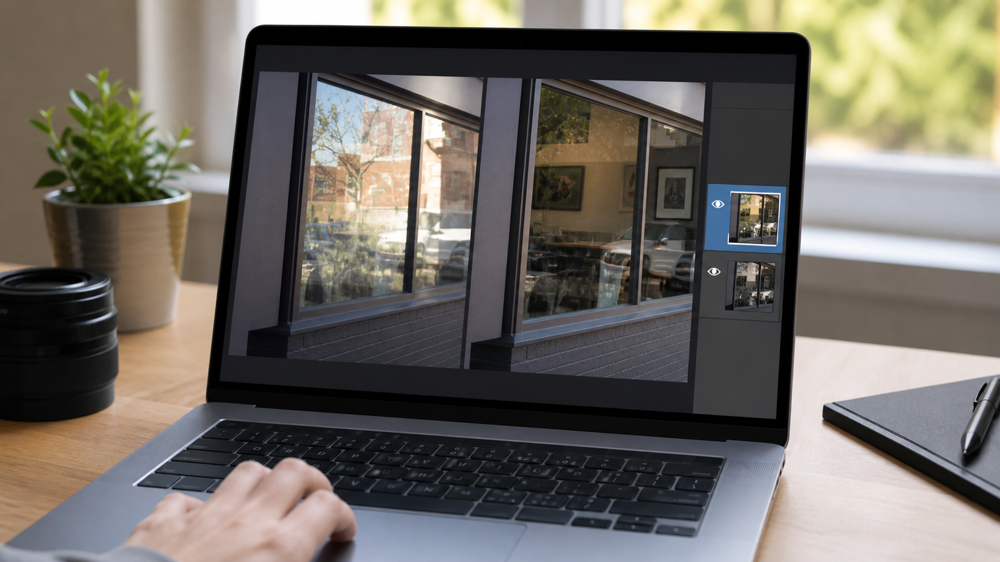
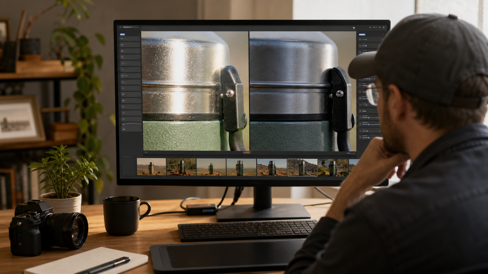

# How to Remove Sunlight Glare From Photo: A Practical Editing Guide

Sunlight can make a photograph feel warm and dimensional, but it can also create a bright patch that hides a face, washes out a product, reflects in a window, or lowers contrast across the whole frame. The useful question is not simply how to make the image darker. It is what kind of glare you have, whether any usable detail remains beneath it, and which edit changes the smallest possible area.

## Quick answer

To **remove sunlight glare from photo** files, first duplicate the original and identify the problem: recoverable bright highlights, a reflection through glass, or lens flare/haze. Use a RAW editor and local mask when highlight detail remains; use a reflection-specific tool or layer-based repair for glass; and use controlled AI photo editing only for mild-to-moderate glare after reviewing the result at full size. If an area is pure white with no recorded detail, no editor can reliably restore the original scene; retaking the photo or using a bracketed exposure is the honest answer.

*Figure 1. Diagnose the source of the bright area before deciding whether to recover, remove, or preserve it.*

## Identify the glare before editing

People use “sun glare” for several different defects. Each needs a different treatment.

| What you see | Likely issue | Best first route | Key limit |
| --- | --- | --- | --- |
| Bright but textured skin, fabric, cloud, or wall | Recoverable highlight | Local RAW adjustment | Pulling highlights too far can turn the image gray |
| A ghost image or bright veil through a window | Reflection | Reflection removal or layered repair | The reflected and hidden scene may overlap |
| Colored circles, streaks, or low-contrast haze | Lens flare | Local correction, crop, or retouch | Flare may be intentional or span the frame |
| A solid white patch with clipped detail | Blown highlight | Retake, alternate exposure, or a transparent creative crop | Software cannot know the missing pixels |

Check the image at 100% before you make an edit. If you can see texture or a faint outline in the bright region, highlight recovery may help. If the bright area contains an unmistakable reflection of trees, a car, the photographer, or a room, treat it as a reflection. If it has circular or polygonal shapes that spread from the sun, it is probably lens flare. Skylum’s explanation of flare notes that a bright light source can either appear in the frame or strike the lens from outside it, creating haze, circles, or colored shapes.

This diagnosis keeps you from creating a flat gray image. The target is not “no sun.” It is a believable photo in which the important subject, color, and local contrast can be read.

## Choose the smallest reliable fix

| Method | Best for | What you keep | What can go wrong |
| --- | --- | --- | --- |
| Recover highlights with a RAW/local mask | Detail is still present in a bright area | Original composition and pixels | Excessive recovery makes skin or sky dull |
| Remove a glass reflection with layers or a reflection tool | Window, car-glass, storefront, or framed-art glare | More of the image behind the glass | Complex overlaps may require a different source photo |
| Use controlled AI editing in HitPaw FotorPea | Mild glare, haze, or a small reflective distraction in an image you own | A guided preview-and-export workflow | AI may invent texture or change important details |

The three methods below are distinct on purpose. A local exposure adjustment does not remove a window reflection, and an object-repair workflow should not be used first on a recoverable RAW highlight.

## Method 1: Recover highlights from the original RAW or high-quality file

**Best for:** backlit portraits with detail in hair or clothing; bright sky around a subject; product photos where the reflective area has texture; images captured in RAW or a high-quality original.

**Not for:** a totally clipped white region, a reflected scene in glass, or a photo that has already been repeatedly compressed.

**Prepare:** the original file, a non-destructive editor with exposure/highlight controls and masks, and an unedited copy.

*Figure 2. Recover only the bright region that still contains detail instead of darkening the entire image.*

1. Open the original file and create a virtual copy or duplicate layer. Keep the original untouched.
2. Turn on highlight-clipping warnings or inspect the histogram. This helps distinguish a bright area with data from a truly clipped patch.
3. Lower highlights before lowering global exposure. Global darkening often muddies the subject and shadows while leaving the local glare distracting.
4. Add a feathered local mask over the glare. Reduce highlights and whites gradually, then adjust local exposure only if necessary.
5. Restore local contrast with a small texture, clarity, or curve adjustment only where the image needs it. Do not sharpen a blown patch; sharpening cannot recreate missing detail.
6. Toggle the edit on and off at normal viewing size and at 100%. Look especially at skin transitions, clouds, printed labels, and smooth gradients.
7. Export a test copy and compare it with the original on the device where it will be used. Compression can exaggerate banding in a recovered sky.

**Result check:** the image should still look sunlit. If the bright edge becomes gray, the skin turns orange, or the shadows become heavy, reduce the correction and preserve some natural highlight.

**Advantages:** this is the most faithful option when the camera recorded usable highlight detail. It keeps editing reversible and does not ask an AI to invent background texture.

**Limits:** it cannot repair pixels that were never captured. If the sun has erased a face, a product label, or a window interior to solid white, use another exposure or retake the photograph.

## Method 2: Separate and repair a reflection through glass

**Best for:** photos through a car window, storefront, display case, framed picture, or house window where sunlight reflects a second scene across the subject.

**Not for:** ordinary overexposure with no reflected image, a single tiny hot spot that a local mask can handle, or a scene where the hidden details are necessary evidence.

**Prepare:** an editor that supports layers or a reflection-removal feature; a duplicate of the source; and, if possible, another frame taken from a slightly different angle.

*Figure 3. Glass glare is an overlap of two scenes, so preserve the original and isolate the repair.*

1. Confirm that the bright area is a reflection by looking for recognizable objects reflected on the glass. Do not call every white patch a reflection.
2. Start with a duplicate layer. Adjust reflections before broad color grading so you can judge what belongs to the hidden scene.
3. If you use Adobe Camera Raw or Photoshop’s current reflection tools, follow the product’s route for reflections and keep the original layer available. Adobe documents its reflection removal as designed for large, full-image reflections caused by shooting through glass, and its desktop workflow can create a separate cleaned layer and reflection layer.
4. Inspect the result at the boundary between the real subject and the reflected scene. Window frames, straight architectural lines, text, faces, and product edges reveal artifacts first.
5. If one part remains inaccurate, mask only that section and use a restrained local repair. A broad AI pass may delete real interior detail along with the reflection.
6. Compare against a second photo from the same sequence when available. A slight change in camera angle can expose detail that the reflected frame hid.
7. Export a copy and inspect at the intended crop. A repair that works at full frame may fail once you crop tightly for social media or a listing.

**Result check:** you should not see doubled window frames, repeated texture, warped lettering, or a subject that suddenly loses an edge. If the reflection covered critical facts, retain the original and use a different photo rather than presenting a reconstructed image as documentation.

**Advantages:** it targets a true reflection instead of indiscriminately reducing brightness. It can preserve more of the natural outdoor lighting than a global exposure correction.

**Limits:** reflections are difficult where both scenes have fine detail. Treat a generated repair as an edited image, not proof of what was behind the glass.

## Method 3: Use HitPaw FotorPea for a controlled mild-glare edit

**Best for:** an authorized photo with mild glare, haze, or a small reflective distraction; a product photo or casual portrait where you can compare the output carefully; readers who want a guided image-editor workflow rather than a complex layer stack.

**Not for:** video, a totally clipped highlight, a third-party photo, invisible provenance marks, creator attribution, or a photo where a reconstructed area would change an important fact.

**Prepare:** the highest-quality image you have, the current FotorPea desktop build, and a duplicate file. FotorPea is the current name for HitPaw Photo Enhancer; its official editor page describes prompt-based image editing, image enhancement, object removal, background removal, model selection, preview, and export. It does not document a dedicated sunlight-glare button, so treat this as a controlled photo-editing test, not a guaranteed glare-recovery feature.

*Figure 4. Review metal edges, labels, and texture at full size before accepting an AI-assisted glare edit.*

1. Open a copy of the photo in FotorPea. Keep the original somewhere you can compare later.
2. Identify whether the issue is mostly brightness, haze, an unwanted reflective streak, or a small object-like distraction. Select the current photo-enhancement or editing path that matches that visual problem; do not stack models simply because they are available.
3. If you use prompt-based editing, ask for a narrow change such as reducing a small glare patch while preserving the subject and lighting. Avoid broad instructions that redesign the whole scene.
4. Generate a preview first. Compare the result to the original at normal size, then zoom in on faces, text, reflective metal, logos, hair, and edges.
5. Reject the result if it invents lettering, changes a product label, removes legitimate highlight shape, alters a person, or repeats texture. Try a smaller adjustment or return to Method 1.
6. Export only after checking the final dimensions, color, and compression. Current plans, Credits, trial rights, batch availability, and platform features change, so confirm them in the official product at publication time.

**Result check:** the edited patch should blend with its surroundings without becoming unnaturally dull. The image should retain the direction and warmth of the original sunlight.

**Advantages:** FotorPea offers a guided preview-and-export image workflow and current official pages list image enhancement and editing features, including object removal. It can be practical for a contained visual problem when you have time to review the pixels.

**Limits:** AI enhancement and editing may rebuild pixels. It cannot prove what an erased highlight originally contained, and it must not be used to remove ownership or copyright information.

## Keep the correction local and preserve the look of daylight

The most common failure is treating glare as a global exposure problem. Lowering exposure, contrast, blacks, saturation, and clarity across the whole frame can make the bright patch less obvious, but it also changes the photograph’s time of day. A beach image can become muddy, a golden-hour portrait can become cold, and a product shot can lose the reflected highlights that explain its material. Work from local to global: correct the smallest bright region first, then make only the global adjustment needed to bring the image together.

Use three checkpoints while you work. First, compare the corrected region with a nearby area that should have similar color or texture. If one cheek, wall, or sky section becomes dramatically darker than its neighbor, reduce the local correction. Second, inspect transitions. Feathered masks should fade naturally; hard masks can leave a visible halo around hair, buildings, or glass. Third, view the image small. A correction that looks technically impressive at 200% can feel heavy-handed when the photo is seen in a feed, listing, or print.

Be especially cautious with these materials:

- **Faces and skin:** retain normal highlight rolloff. Removing every shine mark can make skin look flat or synthetic.
- **Metal, water, and glossy products:** some specular highlights describe shape. Reduce the distracting hot spot while keeping a believable bright edge.
- **Text and labels:** do not use generative repair to guess a letter, price, measurement, or safety instruction. Use another source photo if the text is clipped.
- **Glass:** reflection removal can blend two scenes, so compare straight lines and edges with the original. A clean-looking window that changes the room behind it is not a faithful repair.
- **Sky and gradients:** strong highlight recovery followed by heavy sharpening often creates bands or halos. Export a test JPEG and inspect it on the intended device.

If you have several frames, choose the frame with the most real data before editing. A slightly darker exposure with detail in the subject is usually a better foundation than a brighter image whose key area is white. If you shot RAW plus JPEG, begin with RAW. If you only have a screenshot or a compressed social-media copy, expect less recovery latitude and make smaller edits.

## A simple retake and prevention plan

When the original shot is still possible, prevention is more reliable than repair. Move a step left or right so the sun and reflective surface no longer share the lens angle. Shade the lens with a hood or your hand outside the frame, clean the front element, and remove a cheap protective filter if it causes flare. For a glossy print or framed photo, place the light at an angle and keep the camera off the same reflection axis. Take several frames after small angle changes; one will often reveal the subject without the reflected hotspot.

For difficult landscapes or property images, capture a second exposure for the bright window, sky, or reflective surface. Keep the files together and label them clearly. Blending legitimately captured exposures is different from asking an editor to invent what a clipped frame never recorded. The same principle applies to a product photo: a polarizing filter, diffuser, repositioned light, or change in camera angle can preserve material texture much better than a later AI repair.

When accuracy matters, retain the original beside every edited export and document which correction was applied.

## When to stop editing and use a different source

Stop when the image no longer has enough original information for a truthful repair. Warning signs include a face with featureless white skin, a pure-white product label, an interior completely hidden behind a window reflection, repeated AI texture, warped text, or a sky that bands after recovery. In those cases, use a different frame, recover an original RAW file, blend a legitimately captured bracketed exposure, or retake the photo.

For future shots, shade the lens, clean the front element, remove unnecessary filters, change your angle a few inches, and take an alternate exposure. The best “glare removal” is often a second photo that records the details the first one lost.

## FAQ

### Can I remove sunlight glare from a photo for free?

Yes, if you have an editor that supports local exposure controls, layers, or a free trial. The cost question is separate from quality: choose the route that preserves the most original detail, and check any tool’s current export or Credit terms before relying on it.

### Can editing recover a completely white glare spot?

Not reliably. A local adjustment can reveal detail only when the file contains it. If the camera recorded solid white, any apparent replacement is reconstruction, not recovery.

### Is sun glare the same as a window reflection?

No. Sun glare can be a highlight or lens flare; a window reflection combines the visible subject with a second reflected scene. Adobe’s reflection workflow is specifically aimed at large reflections caused by shooting through glass.

### How do I take a picture of a photo without glare?

Place the camera and light at different angles, avoid pointing a light directly at glossy paper, and use a diffuse light source. Take several frames with small angle changes so you have a clean alternative if one frame catches a reflection.

## Conclusion

The safest way to remove sunlight glare from a photo is to make the smallest change that matches the actual defect. Recover highlights when data remains, isolate glass reflections when two scenes overlap, and use AI-assisted editing only with a saved original and close review. Preserve believable sunlight; do not trade one bright patch for a false-looking image.

## Sources

- [Adobe Photoshop: Remove reflections](https://helpx.adobe.com/uk/photoshop/desktop/repair-retouch/clean-restore-images/remove-reflections.html)
- [Adobe Camera Raw: Remove reflections](https://helpx.adobe.com/uk/camera-raw/desktop/ai-and-generative-features/remove-reflections.html)
- [HitPaw FotorPea: AI photo enhancer](https://www.hitpaw.com/fotorpea-photo-enhancer.html)
- [HitPaw FotorPea: AI photo editor](https://www.hitpaw.com/ai-photo-editor.html)
- [Fotor: observed glare-removal page and limits](https://www.fotor.com/features/remove-glare-from-photo/)
- [CapCut: observed glare, reflection, and lens-flare distinction](https://tools.capcut.com/tools/remove-sun-glare-from-photo)
- [Skylum: observed explanation of lens-flare causes](https://skylum.com/uk/how-to/how-to-remove-glare-from-a-photo)
